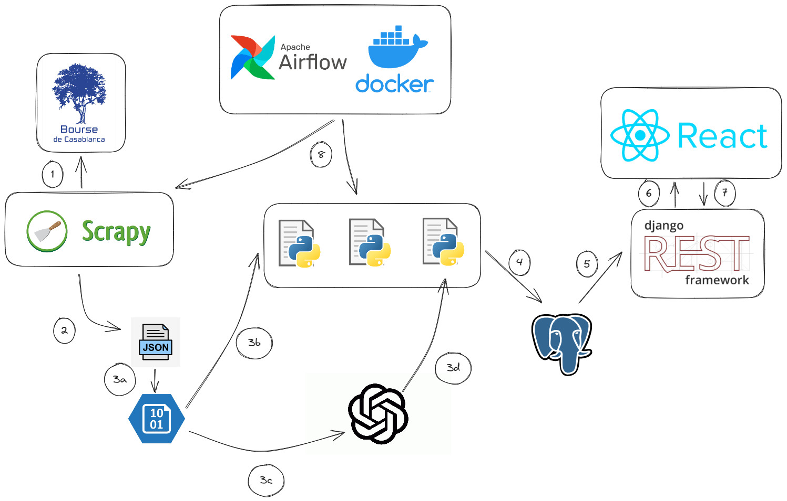

# DGI Bourse Portal 🌐

## Project Architecture 📐✏️

**`Problem Statement`** : 

The Ministry of Economy and Finance's objective to enhance transparency and accessibility to financial data of major companies in Morocco through the creation of a comprehensive dashboard presents several challenges. These challenges include the need to efficiently gather, process, and update data from communiqués de presse, integrate intricate financial information into user-friendly tables, and ensure that the resulting website effectively communicates complex financial metrics to users. Addressing these challenges is critical to achieving the goal of facilitating transparent and accessible financial data for large companies in Morocco.

- 🎯 **`Business Goal`** : 

 We aimed to develop a dashboard that showcases the intricate details from the latest communiqués de presse, combined with comprehensive tables that elucidate key metrics about each company. With a focus on usability, our website ensures that even complex financial data is presented in an understandable and user-friendly manner.

- 🎯 **`Key Features`** :

> - Dashboard with latest communiqué de presse details
> - Comprehensive tables with vital company metrics
> - Intuitive design for easy navigation

- 🎯 **`DGI Portal Demo`** :
  
https://github.com/Heisenberghj7/DGI-Bourse-Portal/assets/92522277/c6b2f5e8-e777-4e03-948e-9af6de363e55

- 📫 Feel free to contact me if anything is wrong or if anything needs to be changed 😎!  **medhajjari9@gmail.com**

### 🤝🏻 **`Collaborators`** : 
 - HAJJARI Mohammed
 - BENCHERIF Mounir
