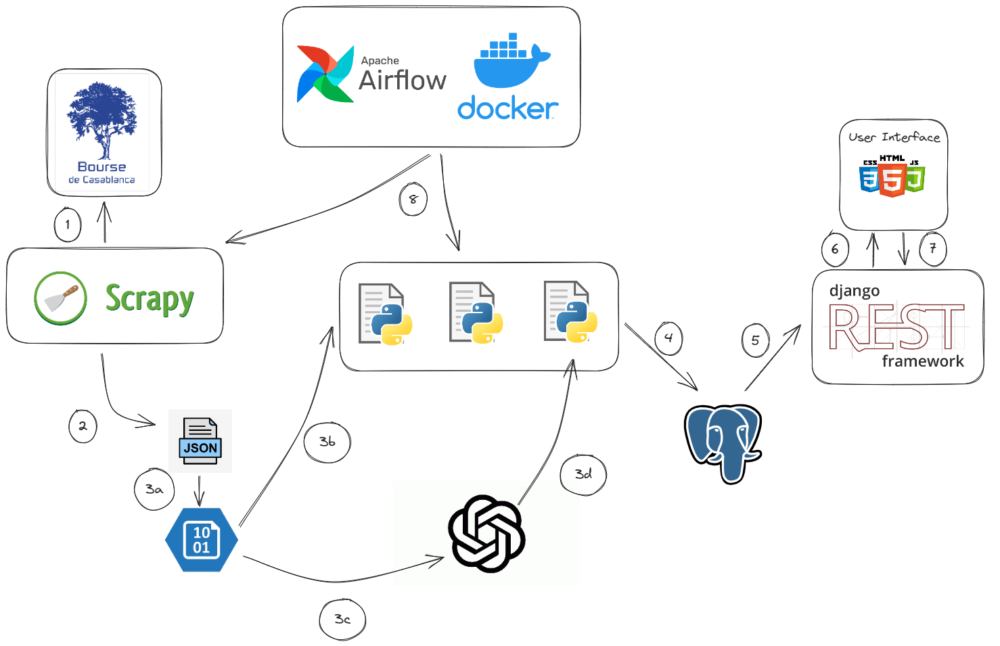

# DGI Bourse Portal 🌐

## Project Architecture 📐✏️

**`Problem Statement`** : 

- 🎯 **`Business Goal`** : 

 We aimed to develop a dashboard that showcases the intricate details from the latest communiqués de presse, combined with comprehensive tables that elucidate key metrics about each company. With a focus on usability, our website ensures that even complex financial data is presented in an understandable and user-friendly manner.

- 🎯 **`Key Features`** :

> - Dashboard with latest communiqué de presse details
> - Comprehensive tables with vital company metrics
> - Intuitive design for easy navigation

- 📫 Feel free to contact me if anything is wrong or if anything needs to be changed 😎!  **medhajjari9@gmail.com**

